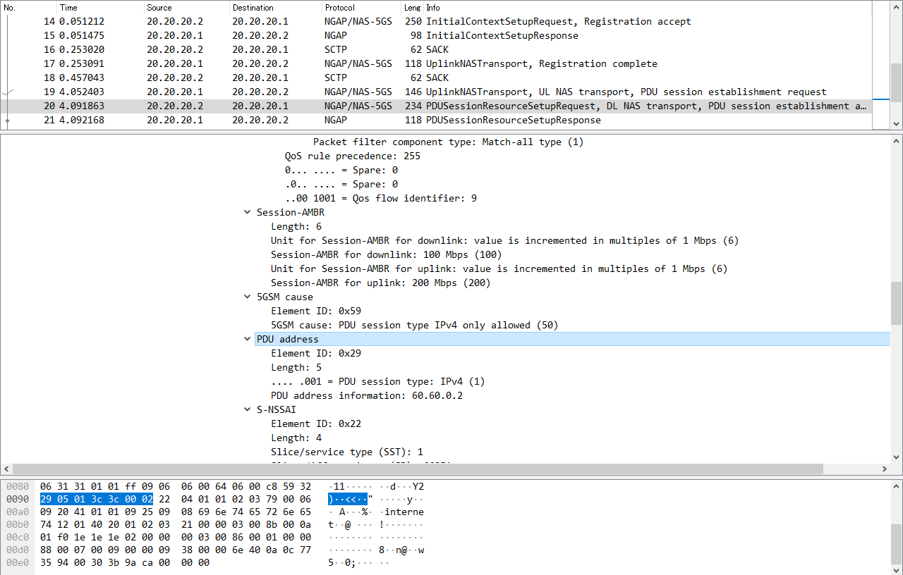

## はじめに

5GではUEのIPアドレスは、どのような仕組みで割り当てられるのでしょうか?
5GCがDHCPサーバーの機能を保有しているのでしょうか?
はたまた、5GCとは別にRADIUSサーバーが存在しており、5GCとRADIUSサーバーが連携することでIPアドレスが割り当てられるのでしょうか?

UEのIPアドレスの割り当てについて、free5GCではどのように実現しているのか解説したいと思います。


## 5Gの規格ではどうなっているのか?

TS 23.501の5.8.2.2 UE IP Address Managementで詳細な仕様が述べられていますが、ざっくりまとめると以下の仕様になっています。

* NGAP/NASを通してUEとSMFの間でPDU Session Typeがやりとりされる。
* PDU Session TypeによってIPv4かIPv6か決まる。
* IPアドレスの割り当ては大きくわけて2種類ある。
  1. PDU Session確立後にDHCPもしくはDN-AAAを利用してIPアドレスの割り当てを行う。
  2. PDU Sessionの確立中にSMFがSM NAS Signalingを介してUEのIPアドレスを送信する。

DHCPやDN-AAA以外にもSMFが割り当てるという仕様も存在することがわかりました。
では実際にfree5GCではどのような実装になっているのか追ってみたいと思います。


## パケットキャプチャで確認

UERANSIMとfree5GCで簡単な構成を組んでパケットをキャプチャして確認してみます。

DHCPやDN-AAAであれば、N3のU-Plane側でそれぞれのプロトコルのやりとりがあるはずです。 一方で、SMFが割り当てる方式であればSM NAS Signalingの中にUEのIPアドレスが入っていることが確認できるはずです。

N3のU-Plane側のキャプチャを見てみましょう。


UEのIPアドレスが確定した状態のパケットしかありません。

今度はN1/N2のC-Plane側のキャプチャを見てみましょう。



UEからのPDU Session Establish requestに対する応答で、NASの中にPDU Addressフィールドがあり、そこにUEのIPアドレスが入っていることが確認できます。

free5GCではDHCP/DN-AAAではなくSMFがUEのIPアドレスを割り当てる実装になっていることがわかりました。


## SMFの実装を追ってみる

SMFのディレクトリを探索してみましょう。

```
github.com/free5gc/smf/
   +- context/
      +- ip_allocator.go
```

contextディレクトリ配下にip_allocator.goという、そのものズバリなソースコードがありますね。まずは構造体を見てみましょう。


```go
type IPAllocator struct {
	ipNetwork *net.IPNet
	g         *_IDPool
}
```

いかにもIPアドレスを割り当てそうな名前の構造体です。
メンバーとしてipNetworkという名前のネットワークアドレスとgという名前のIPアドレスのプールらしきものを保有しています。
この構造体を使って割り当てを行っていると考えて間違いないでしょう。

ネットワークアドレスはわかるとして、この_IDPoolとは具体的になにものなのか見てみましょう。


```go
type _IDPool struct {
	minValue int64
	maxValue int64
	isUsed   map[int64]bool
}
```

ふむふむ。最大値と最小値らしきものを保有してますね。
他にもisUsedというboolean型のマップも持っています。これはIPアドレスが実際に使用されているかどうかを判定するためのものでしょうか。
それにしても不思議です。IPアドレスを表現する型であれば4byteか16byteのbyte列となるはずです。しかし、なぜかint64になっています。

int64の謎は後で詳しく調べることにして、この_IDPoolのメソッドを見てみましょう。

```go
func (i *_IDPool) allocate() (id int64, err error) {
	for id := i.minValue; id <= i.maxValue; id++ {
		if _, exist := i.isUsed[id]; !exist {
			i.isUsed[id] = true
			return id, nil
		}
	}
	return 0, errors.New("No available value range to allocate id")
}

func (i *_IDPool) release(id int64) {
	delete(i.isUsed, id)
}
```

このメソッドからわかることは、allocate()を呼び出すとint64の型の値が返ってくる。そしてallocate()で割り当てられたidをrelease()に渡して呼び出すときっとプールに戻してくれる(はず)。

そして、構造体のメンバーから察すると、minValue以上、maxValue未満の範囲でint64のidを割り当ててくれる。割り当ては常にminValueから順番に探索していき、使用していない最も小さい値を返す。
要らなくなったidをreleaseに渡すとプールに戻してくれて再利用可能な状態にしてくれる。

こんなところでしょうか。

ざっくりした割り当ての方法はここで実装されていそうです。しかしint64という型のままだとIPv4の場合はまだおさまるとして、IPv6の時には困りますね。
このあたりの型変換部分はきっとIPAllocator側でなんとかしているに違いありません。
見てみましょう。


```go
func NewIPAllocator(cidr string) (*IPAllocator, error) {
	allocator := &IPAllocator{}

	if _, ipnet, err := net.ParseCIDR(cidr); err != nil {
		return nil, err
	} else {
		allocator.ipNetwork = ipnet
	}
	allocator.g = newIDPool(1, 1<<int64(32-maskBits(allocator.ipNetwork.Mask))-2)

	return allocator, nil
}
```

newIDPoolの引数がめちゃくちゃ怪しいですね。
第一引数がminで第二引数がmaxです。
minに1を指定しているのはいいとして、maxに指定しているのはなんでしょうか。
ネットワークアドレスのマスク値から算出しているようです。
よくみると、これはホストアドレス部分のmax値を最大でも32bitとしてint64の型にしているようです。
IPv6であってもどうやらIPv4と同じ範囲しか割り当てできなさそうな気配ですね。

IPv6の場合は見なかったことにして(え?)、アロケータの初期化の部分で無理やりint64の範囲におさまるようにしていることがわかりました。

ネットワークアドレスはどこで指定しているかというと、smfcfg.yamlの中の以下の`>>>`の部分です。

```yaml
  userplane_information: # list of userplane information
    up_nodes: # information of userplane node (AN or UPF)
      gNB1: # the name of the node
        type: AN # the type of the node (AN or UPF)
      UPF:  # the name of the node
        type: UPF # the type of the node (AN or UPF)
        node_id: 127.0.0.8 # the IP/FQDN of N4 interface on this UPF (PFCP)
        sNssaiUpfInfos: # S-NSSAI information list for this UPF
          - sNssai: # S-NSSAI (Single Network Slice Selection Assistance Information)
              sst: 1 # Slice/Service Type (uinteger, range: 0~255)
              sd: 010203 # Slice Differentiator (3 bytes hex string, range: 000000~FFFFFF)
            dnnUpfInfoList: # DNN information list for this S-NSSAI
              - dnn: internet
                pools:
>>>               - cidr: 60.60.0.0/16
```

## まとめ

* free5GCでは、DHCPでもRADIUSサーバーでもなく、SMFが独自の方式でUEのIPアドレスの割り当てを行っている。
* free5GCのSMFのIPアドレス割り当ての実装では、IPアドレスプールの中で最も小さい値が割り当てられるようになっている。

## おまけ

私(hirono)だったらisUsedのマップじゃなくてfreeリスト方式にします。
そうすれば割り当ての計算量もO(1)で済みますし解放もO(1)で済みます。

例えばこんな感じです。
https://gist.github.com/khirono/a51298897008c70492be5c94fbc66fcd

int64をやめて[]byteにするとかまだまだ改善の余地はあります。
